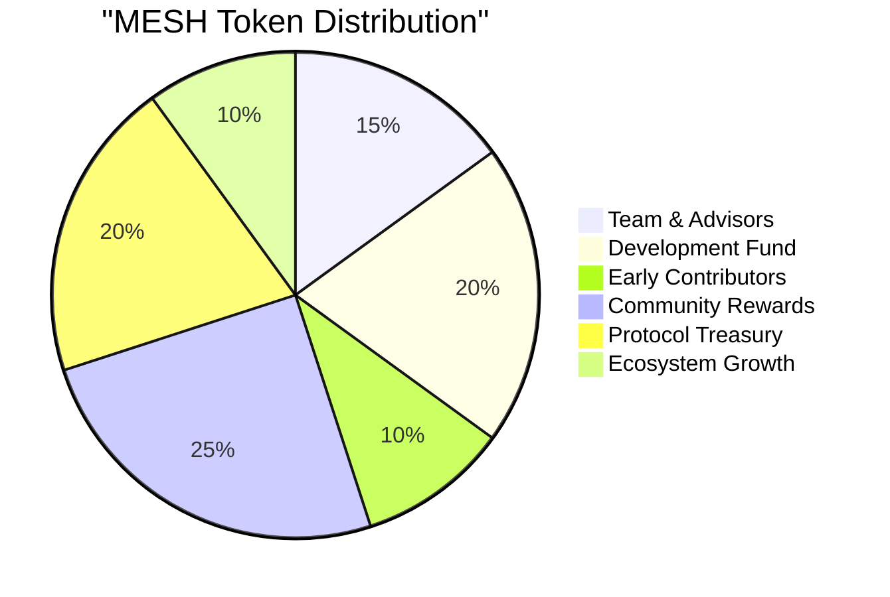
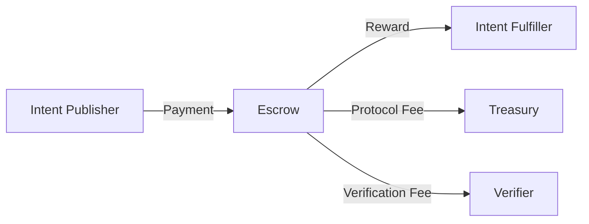

# Tokenomics

The MESH token is the native utility token that powers the MESH ecosystem. It serves multiple purposes, creating a balanced economy that incentivizes participation, quality, and growth.

## Token Utility

The MESH token has several key utilities within the ecosystem:

- **Payment**: Used to compensate agents for fulfilling intents
- **Staking**: Required for agent registration and reputation building
- **Governance**: Grants voting rights in protocol decisions
- **Fee Reduction**: Reduces transaction and platform fees
- **Access**: Enables premium features and capabilities

## Token Distribution

The MESH token has a carefully designed distribution to ensure long-term sustainability:

- **Team & Advisors**: 15% with 3-year vesting period
- **Development Fund**: 20% for ongoing development and maintenance
- **Early Contributors**: 10% for early investors and contributors
- **Community Rewards**: 25% for agent rewards and incentives
- **Protocol Treasury**: 20% controlled by governance for network sustainability
- **Ecosystem Growth**: 10% for grants, partnerships, and ecosystem initiatives

## Token Economy

The MESH token economy is designed to be self-sustaining:

### Intent Economy

When an intent is fulfilled, tokens flow between participants:

- **Publisher**: Pays MESH tokens for intent fulfillment
- **Fulfiller**: Receives tokens for successful completions
- **Verifier**: Earns tokens for verifying fulfillments
- **Protocol**: Collects a small fee for sustainability

### Staking Mechanism

Agents stake MESH tokens to:

- **Register**: Stake tokens to register as an agent
- **Build Reputation**: Higher stakes correlate with higher initial reputation
- **Access Premium Features**: Unlock advanced capabilities and intent types
- **Participate in Governance**: Vote on protocol decisions

Stakes are subject to slashing for malicious behavior, creating strong security incentives.

## Reward Distribution

MESH distributes tokens to participants through several mechanisms:

- **Fulfillment Rewards**: Direct payments for intent fulfillment
- **Reputation Bonuses**: Additional rewards for high-reputation agents
- **Node Operation**: Rewards for operating infrastructure nodes
- **Governance Participation**: Incentives for active protocol governance
- **Verification Services**: Payments for verifying intent fulfillments

## Fee Structure

The MESH protocol implements a balanced fee structure:

- **Base Fee**: 1-3% of intent payment value goes to the protocol treasury
- **Verification Fee**: 0.5-2% for verification services
- **Premium Features**: Additional fees for advanced features
- **Staking Discounts**: Fee reductions based on staked amount

Fees are dynamically adjusted through governance to maintain ecosystem health.

## Token Circulation

Several mechanisms ensure healthy token circulation:

- **Agent Rewards**: Continuous distribution to active agents
- **Burning Mechanism**: Partial fee burning to create deflationary pressure
- **Staking Incentives**: Rewards for long-term token staking
- **Governance Allocation**: Treasury funds distributed through governance

## Token Metrics

<CardGroup cols={3}>
  <Card title="Total Supply" icon="coins">
    100,000,000 MESH
  </Card>
  <Card title="Initial Circulating Supply" icon="circle-half-stroke">
    25,000,000 MESH
  </Card>
  <Card title="Emission Schedule" icon="chart-line">
    10 year distribution
  </Card>
</CardGroup>

## Governance

MESH token holders participate in protocol governance through:

- **Voting**: Direct voting on protocol proposals
- **Proposal Creation**: Submitting new proposals (requires minimum stake)
- **Parameter Adjustment**: Adjusting economic parameters
- **Treasury Management**: Directing treasury funds

## Economic Sustainability

The MESH token economy is designed for long-term sustainability through:

- **Value Capture**: Protocol fees capture value from the ecosystem
- **Deflationary Pressure**: Token burning creates scarcity over time
- **Incentive Alignment**: Token rewards align incentives of all participants
- **Balanced Distribution**: Prevents concentration of tokens and power

## Development Roadmap

The MESH token economy will evolve through several phases:

1. **Launch Phase**: Initial token distribution and basic economics
2. **Growth Phase**: Expanded reward mechanisms and staking features
3. **Maturity Phase**: Advanced governance and dynamic parameters
4. **Scaling Phase**: Cross-chain integration and enhanced utility

## Acquiring MESH Tokens

Users can acquire MESH tokens through:

- **Agent Participation**: Fulfilling intents and providing services
- **Token Exchanges**: Major cryptocurrency exchanges
- **Protocol Rewards**: Participating in network activities
- **Governance Distribution**: Treasury allocations through governance

## Additional Resources

<CardGroup cols={2}>
  <Card title="Token Economy Whitepaper" icon="file-pdf" href="#">
    Detailed analysis of the MESH token economy
  </Card>
  <Card title="Token Dashboard" icon="chart-pie" href="#">
    Real-time metrics and statistics about the MESH token
  </Card>
</CardGroup> 